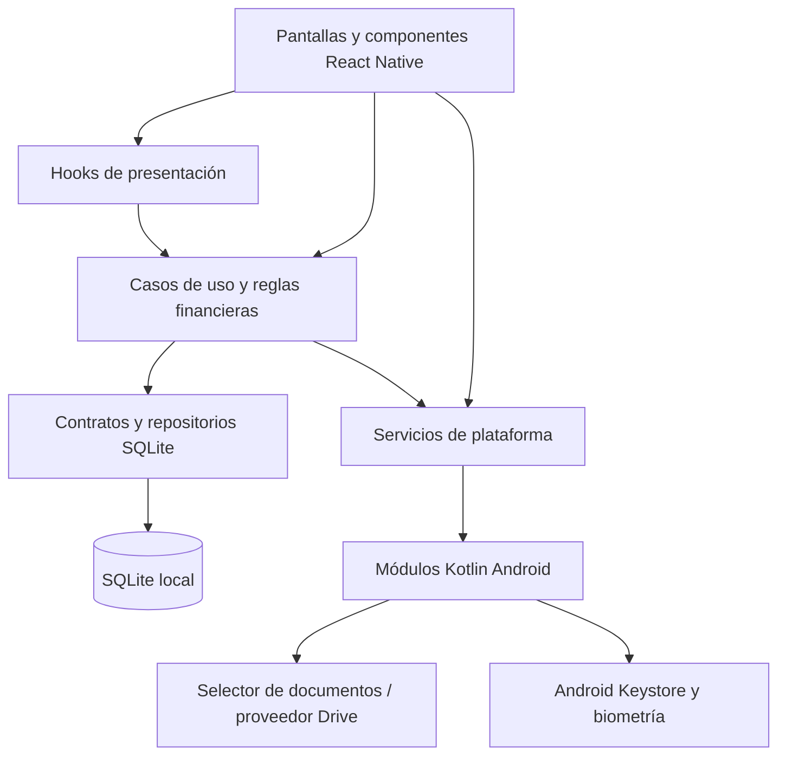
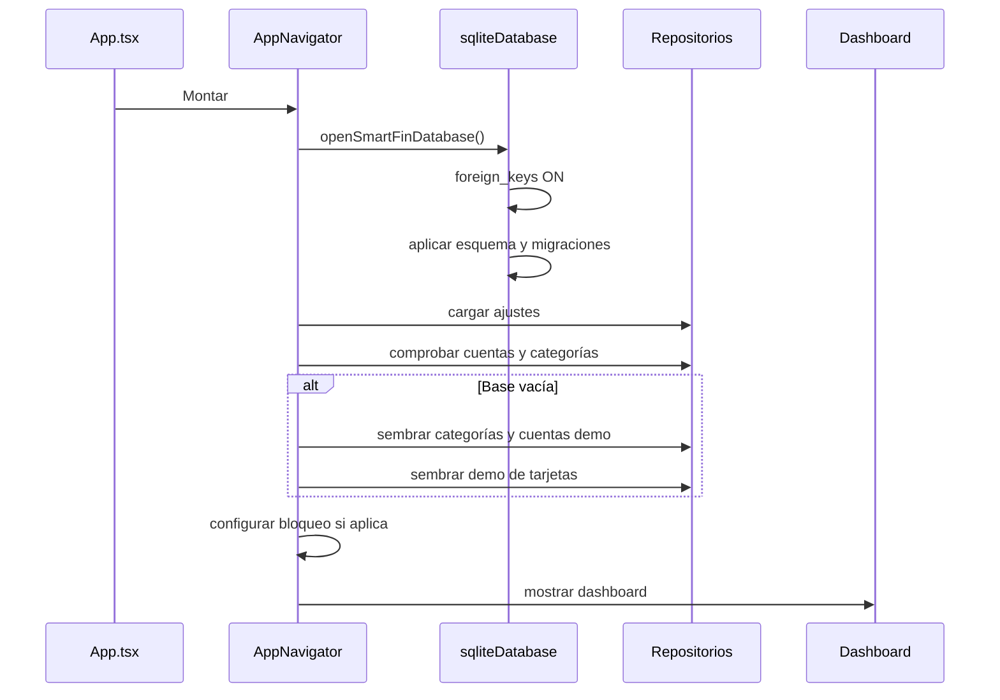
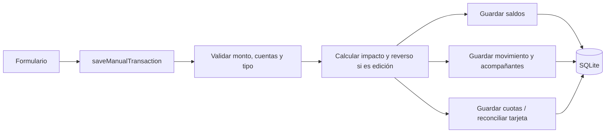

# Arquitectura

## 1. Resumen

SmartFin es una aplicación React Native con dominio y persistencia escritos en TypeScript, SQLite local y dos puentes nativos Kotlin para Android. La arquitectura se organiza por capacidades de negocio y separa interfaz, coordinación, reglas y almacenamiento.



## 2. Capas y reglas

| Capa | Ubicación | Responsabilidad |
|---|---|---|
| Composición | `src/app`, `src/navigation` | Arranque, navegación, ciclo de vida y dependencias |
| UI | `src/modules/*/ui` | Presentación, entrada del usuario y estados visuales |
| Hooks | `src/modules/*/hooks` | Carga y coordinación de estado de presentación |
| Dominio | `src/modules/*/useCases` | Validaciones, cálculos y reglas financieras |
| Persistencia | `src/modules/*/repositories` | Contratos y consultas de cada módulo |
| Base compartida | `src/database` | Conexión, esquema, migraciones ligeras y lectura segura |
| Plataforma | `src/modules/*/services`, `android/...` | Biometría, almacenamiento seguro y exportación |
| Compartido | `src/shared` | Tipos, componentes y utilidades sin dueño de módulo |

Reglas de dependencia:

1. La UI puede llamar hooks y casos de uso, pero no consulta SQLite.
2. Los casos de uso dependen de contratos de repositorio, no de pantallas.
3. Los repositorios traducen entre filas SQLite y tipos de dominio.
4. Las integraciones Android se exponen mediante servicios TypeScript que validan datos `unknown`.
5. Las reglas reutilizables no se duplican en componentes.

## 3. Organización por módulos

Los módulos soportados son `dashboard`, `transactions`, `accounts`, `categories`, `budgets`, `creditCards`, `loans`, `goals`, `subscriptions`, `reports`, `security` y `settings`.

Una capacidad completa puede contener:

```text
src/modules/<feature>/
├── ui/             # pantallas y componentes
├── hooks/          # estado de presentación
├── useCases/       # reglas de negocio
├── repositories/   # persistencia y contratos
├── services/       # límites de plataforma
├── database/       # seed o soporte específico
├── types/          # tipos de dominio
└── index.ts         # API pública del módulo
```

Los módulos `budgets`, `loans`, `goals`, `subscriptions` y `reports` son marcadores de estructura: su `index.ts` está vacío y no representan funcionalidad disponible.

## 4. Secuencia de arranque



La conexión se comparte mediante una promesa a nivel de módulo. Al desmontar el navegador se cierra. Después de exportar un respaldo, se reabre y se reconstruye el repositorio de ajustes.

## 5. Navegación

No se usa una librería de navegación. `AppNavigator` mantiene una unión `AppRoute` y renderiza una pantalla a la vez:

```text
dashboard
├── transactions
├── creditCards
├── debitCards
└── settings
    └── categories
```

La barra inferior comparte accesos a inicio, movimientos y el menú de más opciones. El navegador también coordina:

- el bloqueo global de acceso;
- la actualización del dashboard tras mutaciones;
- borrado y re-seed;
- estado de respaldo;
- borradores de transferencia enviados desde cuentas débito.

## 6. Persistencia

- Archivo lógico: `smartfin.db`.
- Motor: SQLite embebido.
- Integridad: `PRAGMA foreign_keys = ON`.
- Inicialización: DDL idempotente y migraciones ligeras en código.
- Conversión: `sqliteRows.ts` valida primitivas antes de mapearlas.
- Identificadores: texto generado por la aplicación.
- Fechas: cadenas ISO 8601.
- Dinero: números JavaScript y columnas `REAL`, con COP como única moneda de dominio.

El detalle del esquema y las relaciones está en [Base de datos](BASE_DE_DATOS.md).

## 7. Flujo de una escritura financiera

Ejemplo de un movimiento manual:



El caso de uso es responsable de evitar que una edición aplique dos veces el saldo anterior, crear la pata destino de una transferencia y mantener la relación de cuotas.

## 8. Integraciones nativas Android

### `SmartFinSecurity`

- Comprueba disponibilidad biométrica y seguridad del dispositivo.
- Presenta `BiometricPrompt`.
- Cifra y descifra la credencial local con AES-GCM.
- Mantiene la clave en Android Keystore y el valor cifrado en preferencias privadas.

### `SmartFinDriveBackup`

- Abre `ACTION_OPEN_DOCUMENT_TREE`.
- Conserva el permiso URI cuando el proveedor lo permite.
- Escribe SQLite, CSV y manifiesto mediante `DocumentsContract`.
- No usa OAuth ni la API de Google Drive.

Los servicios TypeScript comprueban plataforma, presencia de métodos y forma de las respuestas antes de exponer resultados tipados.

## 9. Estado y refresco

El estado es local a componentes y hooks; `src/store` no contiene un store global operativo. `dashboardRefreshKey` funciona como señal de invalidación después de una mutación. Esto es suficiente para la escala actual, aunque un crecimiento de rutas y datos puede justificar un coordinador de navegación y caché más formal.

## 10. Decisiones y compromisos actuales

| Decisión | Beneficio | Compromiso |
|---|---|---|
| SQLite local | Privacidad y operación offline | Sin sincronización entre dispositivos |
| Arquitectura por feature | Cambios acotados y ownership claro | Puede duplicar contratos si no se cuida la API pública |
| Navegación propia | Pocas dependencias | Historial, deep links y transiciones son limitados |
| Números JS para dinero | Simplicidad | Riesgo de precisión; los flujos actuales redondean importes sensibles |
| Metadatos en `description` | Evita migraciones tempranas | Menor consultabilidad y contrato implícito |
| DDL idempotente en código | Arranque sencillo | Las migraciones complejas requerirán versionado formal |
| Mocks como seed y fallback | Desarrollo rápido | Los datos demo pueden confundirse con datos reales si no se distinguen |

## 11. Límites para nuevas capacidades

- Un backend o sincronización debe entrar detrás de interfaces de repositorio/servicio.
- Ninguna pantalla nueva debe importar `react-native-sqlite-storage`.
- Una regla financiera nueva debe tener un caso de uso puro o inyectable y pruebas.
- Una nueva respuesta nativa debe tratarse como `unknown` y validarse.
- Los cambios de esquema deben mantener compatibilidad con bases ya instaladas.
