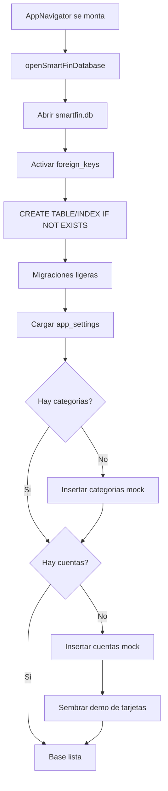

# Base de datos de SmartFin

> Estado documentado: 26 de septiembre de 2026.  
> Fuentes de verdad: `src/database/sqliteSchema.ts`, `src/database/sqliteDatabase.ts` y los repositorios `sqlite*Repository.ts` de cada modulo.

## 1. Resumen ejecutivo

SmartFin usa una base de datos **SQLite local** llamada `smartfin.db`, mediante `react-native-sqlite-storage`. No existe un servidor, sincronizacion remota, telemetria ni una API de persistencia. En Android el usuario puede exportar manualmente una copia visible a una carpeta de Google Drive mediante el selector de documentos del sistema, sin API de Drive ni OAuth.

El esquema contiene **28 tablas**, incluida una tabla interna de revision para detectar respaldos desactualizados. La aplicacion actual lee o escribe de forma funcional principalmente 9 tablas de dominio:

- `app_settings`
- `accounts`
- `categories`
- `merchant_mappings`
- `transactions`
- `credit_card_statements`
- `credit_card_profiles`
- `installment_purchases`
- `smart_alerts`

Las demas tablas dejan preparado el modelo para subcategorias, presupuestos, sobres, suscripciones, prestamos, metas, inversiones, recibos, impuestos, flujo de caja, salud financiera y respaldos. Que una tabla exista no significa que su modulo ya tenga repositorio o interfaz terminados.

## 2. Tecnologia y ubicacion

| Elemento | Implementacion |
|---|---|
| Motor | SQLite embebido en el dispositivo |
| Libreria | `react-native-sqlite-storage` `^6.0.1` |
| Archivo logico | `smartfin.db` |
| Ubicacion | `location: 'default'`, resuelta por la libreria para cada plataforma |
| Apertura | Una promesa compartida mantiene una sola conexion durante la vida de la app |
| Integridad referencial | `PRAGMA foreign_keys = ON` al aplicar el esquema |
| Fechas | Texto ISO 8601 |
| Moneda de dominio actual | `COP` |
| Importes | Columnas SQLite `REAL` y numeros de JavaScript |
| Identificadores | `TEXT`, generados por la aplicacion |

Archivos principales:

| Archivo | Responsabilidad |
|---|---|
| `src/database/sqliteSchema.ts` | DDL de las tablas, claves foraneas e indices |
| `src/database/sqliteDatabase.ts` | Apertura, cierre, aplicacion del esquema y migraciones ligeras |
| `src/database/sqliteRows.ts` | Validacion y conversion segura de filas SQLite |
| `src/database/seedSmartFinDatabase.ts` | Carga de cuentas, categorias y transacciones mock; esta funcion existe pero el arranque normal usa su propio seed condicional |
| `src/navigation/AppNavigator.tsx` | Abre/cierra la conexion y ejecuta el seed inicial usado por la app |

## 3. Flujo de inicializacion

Detalles importantes:

1. El esquema se ejecuta cada vez que se abre la base mediante sentencias idempotentes `CREATE ... IF NOT EXISTS`.
2. Si no hay categorias, se cargan las categorias mock.
3. Si no hay cuentas, se cargan cuentas mock y datos demo de tarjetas. Despues de borrar datos financieros se recrean las cuentas con saldo cero y no se vuelve a cargar la demo de tarjetas.
4. La conexion se cierra al desmontar `AppNavigator`.

## 4. Modelo relacional

El siguiente diagrama muestra las relaciones declaradas. Las uniones punteadas representan referencias polimorficas guardadas como texto y no forzadas por una clave foranea.

```mermaid
erDiagram
    ACCOUNTS ||--o{ TRANSACTIONS : origen
    ACCOUNTS ||--o{ TRANSACTIONS : destino
    CATEGORIES ||--o{ TRANSACTIONS : clasifica
    SUBCATEGORIES ||--o{ TRANSACTIONS : detalla
    RAW_FINANCIAL_MESSAGES ||--o{ TRANSACTIONS : origina

    CATEGORIES ||--o{ SUBCATEGORIES : contiene
    CATEGORIES ||--o{ MERCHANT_MAPPINGS : asigna
    SUBCATEGORIES ||--o{ MERCHANT_MAPPINGS : asigna
    ACCOUNTS ||--o{ MERCHANT_MAPPINGS : asocia

    TRANSACTIONS ||--o{ TRANSACTION_SPLITS : divide
    CATEGORIES ||--o{ TRANSACTION_SPLITS : clasifica
    SUBCATEGORIES ||--o{ TRANSACTION_SPLITS : detalla
    ACCOUNTS ||--o{ ACCOUNT_BALANCE_HISTORY : registra

    CATEGORIES ||--o{ ENVELOPES : agrupa
    ENVELOPES ||--o{ ENVELOPE_MOVEMENTS : mueve
    TRANSACTIONS ||--o{ ENVELOPE_MOVEMENTS : respalda

    CATEGORIES ||--o{ RECURRING_SUBSCRIPTIONS : clasifica
    SUBCATEGORIES ||--o{ RECURRING_SUBSCRIPTIONS : detalla
    ACCOUNTS ||--o{ RECURRING_SUBSCRIPTIONS : cobra

    ACCOUNTS ||--o{ LOANS : representa
    LOANS ||--o{ AMORTIZATION_SCHEDULE_ITEMS : calendario
    TRANSACTIONS ||--o{ AMORTIZATION_SCHEDULE_ITEMS : paga

    ACCOUNTS ||--o{ CREDIT_CARD_STATEMENTS : genera
    ACCOUNTS ||--o| CREDIT_CARD_PROFILES : configura
    ACCOUNTS ||--o{ INSTALLMENT_PURCHASES : financia
    TRANSACTIONS ||--o{ INSTALLMENT_PURCHASES : origina

    ACCOUNTS ||--o{ FINANCIAL_GOALS : vincula
    ACCOUNTS ||--o{ INVESTMENT_ASSETS : contiene
    TRANSACTIONS ||--o{ RECEIPT_ATTACHMENTS : adjunta
    TRANSACTIONS ||--o{ TRANSACTION_TAX_TAGS : etiqueta
    TAX_TAGS ||--o{ TRANSACTION_TAX_TAGS : aplica
    ACCOUNTS ||--o{ CASH_FLOW_EVENTS : proyecta
```

## 5. Diccionario de tablas

### Configuracion y nucleo financiero

| Tabla | Proposito y campos principales | Relaciones | Uso actual |
|---|---|---|---|
| `app_settings` | Preferencias clave/valor: `setting_key` (PK), `setting_value`, `updated_at`. Guarda tema, biometria y credencial local. | Ninguna | Lectura y escritura |
| `accounts` | Cuentas y productos: nombre, tipo, estado, moneda, saldo, deuda, cupo, institucion y descripcion. `id` es PK. | Tabla padre de movimientos y varios productos | Lectura y escritura |
| `categories` | Categorias de ingreso/gasto/deuda/inversion/transferencia/ajuste. Guarda nombre, macro-categoria y color. | Padre de clasificaciones | Lectura, escritura y eliminacion con reasignacion |
| `subcategories` | Detalle por categoria, color, estado y auditoria. | `category_id -> categories.id` | Esquema preparado; mantenimiento al borrar categorias |
| `transactions` | Libro de movimientos: importe, moneda, descripcion, fecha, cuenta, categoria, tipo, direccion, estado, comercio, medio de pago, pista de tarjeta, clave de deduplicacion y notas. | Cuentas, categorias, subcategorias y mensaje de origen | Lectura, escritura, recategorizacion y eliminacion |
| `transaction_splits` | Division de un movimiento entre importes/categorias. | `transaction_id -> transactions.id` con `ON DELETE CASCADE` | Esquema preparado; solo mantenimiento |
| `merchant_mappings` | Regla aprendida comercio -> categoria/subcategoria/cuenta. Incluye patron, contador y ultima coincidencia. | Categorias, subcategorias y cuentas | Lectura y escritura parcial |
| `raw_financial_messages` | Tabla historica que conservaba mensajes automaticos y resultados del parser. Permanece en el esquema por compatibilidad con bases instaladas. | Puede ser padre de `transactions` | Sin escrituras ni lecturas desde la aplicacion |
| `account_balance_history` | Fotografias historicas de saldo y deuda por cuenta. | `account_id -> accounts.id` con `ON DELETE CASCADE` | Esquema preparado |

### Presupuestos, sobres y recurrencias

| Tabla | Proposito y campos principales | Relaciones | Uso actual |
|---|---|---|---|
| `budgets` | Presupuesto por alcance, importe, periodo, fechas y umbrales de alerta 50/80/90/100 %. | `scope_type` y `scope_id` son una referencia logica, no FK | Esquema preparado |
| `envelopes` | Sobre de ahorro/gasto con objetivo, saldo, prioridad y categoria. | `category_id -> categories.id` | Esquema preparado; mantenimiento al borrar categorias |
| `envelope_movements` | Entradas/salidas de un sobre, opcionalmente ligadas a una transaccion. | Sobre con `CASCADE`; transaccion sin accion de borrado declarada | Esquema preparado; se limpia al borrar transacciones |
| `recurring_subscriptions` | Suscripciones por comercio, importe, periodicidad, proximo cobro y estado. | Categoria, subcategoria y cuenta | Esquema preparado; mantenimiento al borrar categorias |

### Deudas y tarjetas de credito

| Tabla | Proposito y campos principales | Relaciones | Uso actual |
|---|---|---|---|
| `loans` | Prestamo: principal, saldo pendiente, tasa anual, plazo, cuota y fechas. | `account_id -> accounts.id` | Esquema preparado |
| `amortization_schedule_items` | Cuotas de un prestamo con capital, interes, saldo y estado. | Prestamo con `CASCADE`; transaccion opcional | Esquema preparado; se limpia al borrar transacciones |
| `credit_card_statements` | Extractos por tarjeta: periodo, vencimiento, total, pago minimo y estado. | `account_id -> accounts.id` con `ON DELETE CASCADE` | Lectura y escritura |
| `credit_card_profiles` | Configuracion financiera 1:1 de tarjeta; actualmente tasa de interes mensual. | PK/FK `account_id -> accounts.id` con `ON DELETE CASCADE` | Lectura y escritura |
| `installment_purchases` | Compra a cuotas: transaccion, tarjeta, total, numero de cuotas, pagadas, valor mensual y estado. | Transaccion con `CASCADE`; cuenta | Lectura, escritura y reasignacion |
| `smart_alerts` | Alertas tipadas con severidad, entidad relacionada, estado y fechas. | Referencia logica por tipo/id, no FK | Se usa para avisar tarjetas faltantes |

Los metadatos visuales de una tarjeta (`closingDay`, `paymentDay`, ultimos cuatro digitos y cuota de manejo) no tienen columnas propias. Se serializan como JSON dentro de `accounts.description`, con el prefijo `smartfin:credit-card:`.

### Metas, inversiones y documentos

| Tabla | Proposito y campos principales | Relaciones | Uso actual |
|---|---|---|---|
| `financial_goals` | Meta, objetivo, avance, fecha, prioridad y estado. | Cuenta vinculada opcional | Esquema preparado |
| `investment_assets` | Activo, tipo, cantidad, precios, moneda, plataforma y fecha de compra. | Cuenta opcional | Esquema preparado |
| `receipt_attachments` | URI local del recibo, datos extraidos y texto OCR. | Transaccion; `ON DELETE SET NULL` | Esquema preparado; se elimina manualmente al borrar transacciones |
| `tax_tags` | Etiquetas fiscales configurables. | Padre de la tabla puente | Esquema preparado |
| `transaction_tax_tags` | Relacion N:M entre transacciones y etiquetas fiscales. | Ambas FK con `ON DELETE CASCADE` | Esquema preparado |
| `cash_flow_events` | Evento proyectado de ingreso/gasto con fecha y entidad de origen. | Cuenta opcional; origen polimorfico sin FK | Esquema preparado |
| `financial_health_scores` | Puntaje total y componentes de ahorro, deuda, emergencia, credito, metas y gasto variable. | Ninguna | Esquema preparado |
| `backup_records` | Registro de respaldo local: URI, cifrado, estado, fechas y error. | Ninguna | Esquema preparado |
| `financial_data_revision` | Contador interno que aumenta mediante triggers cuando cambia una tabla financiera. | Ninguna | Deteccion de respaldos desactualizados |

## 6. Respaldo visible en Google Drive (Android)

La integracion usa Storage Access Framework de Android. La primera vez, el usuario pulsa **Elegir carpeta** y selecciona o crea una carpeta dentro de Google Drive. Android conserva el permiso para esa carpeta; SmartFin no recibe credenciales de Google y no usa una API remota.

Cada actualizacion genera o reemplaza:

- `smartfin-backup.db`: copia completa y sin cifrar de SQLite;
- `movimientos-AAAA.csv`: un archivo por cada año con movimientos, cuenta, categoria, comercio, medio de pago y fechas;
- `cuentas.csv`, `categorias.csv`, `subcategorias.csv`, `tarjetas-credito.csv` y `compras-cuotas.csv`;
- `smartfin-manifest.json`: revision, fecha, lista de archivos y declaracion `encrypted: false`.

Los CSV usan UTF-8 con BOM, encabezados estables y escapado compatible con RFC 4180. Esto facilita abrirlos en Excel o analizarlos desde herramientas con acceso autorizado a Drive. Los importes se exportan como valores numericos y las fechas conservan su representacion ISO.

Antes de copiar la base, la aplicacion ejecuta un checkpoint de WAL y cierra SQLite. Luego vuelve a abrirla. El contador `financial_data_revision` aumenta con triggers para inserciones, actualizaciones y eliminaciones en las tablas financieras. Si la revision local supera la del manifiesto de Drive, se muestra un aviso dentro de SmartFin con la opcion **Actualizar ahora**. No se solicitan permisos para leer notificaciones del sistema.

La actualizacion es iniciada por el usuario. El estado **al dia** significa que SmartFin escribio los archivos y pudo volver a leer el manifiesto mediante el proveedor de documentos. No confirma que la transferencia a los servidores de Google haya terminado. Sin API de Drive, Android y el proveedor controlan la subida real a la nube; el usuario debe comprobar **Carga completa** en la aplicacion de Google Drive o verificar que los archivos aparezcan en `drive.google.com` desde otro dispositivo.

SmartFin intenta conservar el permiso de lectura/escritura entre reinicios. Si un proveedor solo concede acceso temporal, el respaldo actual se completa y Ajustes muestra una advertencia. Si Android pierde posteriormente el acceso, SmartFin elimina la referencia vencida y solicita seleccionar de nuevo la misma carpeta.

La capacidad de escritura se confirma intentando crear o reemplazar los archivos del respaldo. No se usa `FLAG_DIR_SUPPORTS_CREATE` como bloqueo previo porque algunos proveedores de documentos en la nube no anuncian ese indicador de manera consistente aunque acepten escrituras.

> Privacidad: estos archivos no estan cifrados. Cualquier persona, aplicacion o servicio de IA con acceso a la carpeta podra leer la informacion financiera.

## 7. Valores de dominio implementados

SQLite almacena estos valores como `TEXT`; las restricciones se expresan en TypeScript, no mediante `CHECK` en la base.

| Concepto | Valores actuales |
|---|---|
| Tipo de cuenta | `cash`, `bankAccount`, `savingsAccount`, `creditCard`, `loan`, `investment` |
| Estado de cuenta | `active`, `inactive`, `closed` |
| Tipo de transaccion | `income`, `expense`, `internalTransfer`, `creditCardPayment`, `loanPayment`, `investment`, `refund`, `manualAdjustment` |
| Direccion | `inflow`, `outflow`, `neutral` |
| Estado de transaccion | `posted`, `pending`, `cancelled` |
| Medio de pago | `debit`, `credit` |
| Tipo de categoria | `income`, `expense`, `debt`, `investment`, `transfer`, `adjustment` |
| Moneda | `COP` |
| Estado de extracto | `open`, `pending`, `paid`, `overdue`, `closed` |
| Estado de compra a cuotas | `active`, `paid`, `cancelled` |

## 8. Repositorios y operaciones disponibles

La interfaz de usuario recibe la conexion y crea repositorios por modulo. Los repositorios convierten filas SQLite a tipos de dominio; las pantallas no ejecutan SQL directamente.

| Repositorio/servicio | Operaciones principales |
|---|---|
| `sqliteAccountRepository` | Listar cuentas; guardar una coleccion de cuentas |
| `sqliteCategoryRepository` | Listar/guardar categorias; borrar una categoria reasignando referencias |
| `sqliteTransactionRepository` | Listar/guardar/borrar; actualizar categorias; guardar/consultar reglas de comercio; borrar compras a cuotas relacionadas |
| `sqliteCreditCardRepository` | Listar y cerrar tarjetas; guardar tarjetas, extractos, perfiles y compras a cuotas; reasignar compras |
| `sqliteCreditCardAlertRepository` | Consultar, crear y resolver alertas de tarjeta faltante |
| `sqliteSettingsRepository` | Cargar y guardar preferencias |
| `sqliteFinancialDataRepository` | Vaciar todas las tablas financieras conservando `app_settings` |

Los mocks de cuentas, categorias y transacciones implementan contratos equivalentes para pruebas y datos iniciales.

## 9. Captura automatica retirada

SmartFin ya no solicita permisos de SMS ni acceso al lector de notificaciones del sistema. Se retiraron:

- los permisos Android `READ_SMS` y `RECEIVE_SMS`;
- el `BroadcastReceiver` de SMS;
- el `NotificationListenerService`;
- el modulo nativo que solicitaba permisos y emitia eventos a React Native;
- el parser, el servicio de ingestion y la creacion automatica de transacciones;
- el onboarding y los controles de ajustes relacionados.

Los movimientos se registran mediante los flujos manuales de la aplicacion. Las alertas internas de SmartFin, como una tarjeta pendiente de configurar, se conservan porque no acceden a SMS ni a notificaciones de otras aplicaciones.

`raw_financial_messages`, `transactions.source_message_id` y `transactions.dedupe_key` permanecen como elementos de compatibilidad del esquema. No se usan para capturar nuevos datos y evitan una reconstruccion destructiva de bases SQLite existentes.

## 10. Migraciones e indices

No hay un sistema de migraciones versionado. Despues de aplicar el DDL, `applyLightweightMigrations` intenta ejecutar:

1. `ALTER TABLE transactions ADD COLUMN payment_method TEXT`;
2. `ALTER TABLE transactions ADD COLUMN credit_card_hint TEXT`;
3. `ALTER TABLE transactions ADD COLUMN dedupe_key TEXT`;
4. indice unico parcial de `dedupe_key`.

Los errores de esas sentencias se ignoran para tolerar columnas ya existentes. El esquema tampoco usa `PRAGMA user_version` ni una tabla de historial de migraciones.

Indices definidos:

- busqueda de transacciones por fecha, cuenta, categoria, subcategoria y mensaje fuente;
- unicidad de subcategoria por categoria/nombre;
- busqueda de reglas por texto crudo;
- mensajes por fecha de recepcion;
- historico de saldos por cuenta/fecha;
- presupuestos por alcance;
- movimientos por sobre;
- suscripciones por proximo cobro;
- prestamos por cuenta y cuota unica por prestamo/numero;
- extractos por cuenta/vencimiento;
- perfiles y compras a cuotas por cuenta;
- metas por estado, inversiones por cuenta y recibos por transaccion;
- flujo de caja por fecha, alertas por estado y puntajes por fecha.

## 11. Borrado de datos

La opcion de borrar datos financieros:

1. desactiva temporalmente las claves foraneas;
2. ejecuta `DELETE` sobre las 26 tablas financieras en un orden fijo;
3. reactiva las claves foraneas en un bloque `finally`;
4. conserva `app_settings`;
5. vuelve a sembrar categorias y cuentas esenciales, con saldos de cuenta en cero.

No elimina el archivo `smartfin.db`. Tampoco ejecuta `VACUUM`, por lo que SQLite puede conservar espacio interno reutilizable aunque las filas ya no sean consultables por la aplicacion.

## 12. Privacidad y seguridad

- La arquitectura es local-first y offline-first.
- No hay llamadas propias de red ni una API de SmartFin para persistir datos. En Android, Google Drive puede sincronizar los archivos elegidos mediante su proveedor de documentos.
- Los recibos y respaldos se modelan mediante URI local.
- La aplicacion no solicita acceso a SMS ni a las notificaciones del sistema.
- La biometria y la credencial local controlan acceso a la aplicacion, pero **el codigo revisado no configura cifrado de la base SQLite**.
- El respaldo visible en Drive se implementa sin cifrado por decision del usuario; `backup_records` sigue sin utilizarse como historial funcional.
- Instalaciones que usaron versiones anteriores pueden conservar filas historicas en `raw_financial_messages` hasta que el usuario borre sus datos financieros.

Por tanto, la proteccion del archivo depende actualmente del almacenamiento y las medidas de seguridad del sistema operativo. Para datos reales conviene evaluar cifrado en reposo, politica de retencion de mensajes crudos y ocultamiento de datos sensibles en logs.

## 13. Riesgos y deuda tecnica observada

Prioridad alta:

1. **Migraciones sin version:** cualquier error, no solo "columna duplicada", se ignora. Esto puede dejar instalaciones con esquemas diferentes sin diagnostico.
2. **`INSERT OR REPLACE`:** en SQLite puede eliminar la fila en conflicto antes de insertarla. En tablas padre como `accounts` o `transactions` esto puede activar acciones `ON DELETE` y perder filas hijas. Es mas seguro usar `INSERT ... ON CONFLICT DO UPDATE`.
3. **Importes en `REAL`:** el punto flotante puede introducir errores de redondeo. Para contabilidad se recomienda guardar unidades menores enteras (centavos) o una representacion decimal controlada.
4. **Escrituras por lote sin transaccion:** los bucles de guardado y el borrado total pueden quedar aplicados parcialmente si una sentencia falla.
5. **Base sin cifrado explicito:** contiene saldos y movimientos; instalaciones actualizadas tambien pueden conservar mensajes financieros historicos.

Prioridad media:

6. Los estados y tipos no tienen restricciones `CHECK`; una escritura fuera de TypeScript puede introducir valores invalidos.
7. La FK `transactions.source_message_id` y la tabla `raw_financial_messages` son compatibilidad historica sin uso funcional.
8. Algunas eliminaciones se resuelven manualmente aunque el esquema tenga acciones FK distintas; por ejemplo, los recibos se borran en vez de conservarse con `transaction_id = NULL`.
9. Los metadatos visuales de tarjeta se almacenan como JSON en `accounts.description`; esto dificulta validarlos, consultarlos e indexarlos.
10. El seed de arranque esta duplicado respecto de `seedSmartFinDatabase`, lo que puede hacer que ambos flujos diverjan.
11. Varias tablas anticipadas aun no tienen repositorio, caso de uso ni pruebas funcionales.

## 14. Recomendaciones de evolucion

Orden sugerido:

1. Introducir migraciones numeradas y atomicas usando `PRAGMA user_version` o una tabla `schema_migrations`.
2. Sustituir `INSERT OR REPLACE` por UPSERT y envolver operaciones de lote en transacciones SQLite.
3. Definir una estrategia monetaria unica basada en enteros de unidad menor.
4. Añadir cifrado en reposo o documentar formalmente el modelo de seguridad aceptado.
5. Planificar una migracion versionada si se decide eliminar definitivamente las columnas y tablas historicas de captura automatica.
6. Separar los metadatos de tarjeta en columnas o en una tabla 1:1 tipada.
7. Crear repositorios por modulo a medida que se habiliten presupuestos, prestamos, metas y demas funciones; no acceder a SQLite desde las pantallas.
8. Añadir pruebas de migracion desde bases antiguas, integridad FK, borrado total y persistencia tras reinicio.

## 15. Guia para cambios futuros

Al modificar la persistencia:

1. Actualizar el esquema para instalaciones nuevas.
2. Añadir una migracion versionada para instalaciones existentes.
3. Mantener el SQL dentro de `repositories`, `services` o adaptadores de `src/database`.
4. Actualizar los tipos de dominio y los validadores de filas.
5. Añadir indices solo a partir de consultas reales y comprobar su plan de ejecucion.
6. Ejecutar pruebas y `tsc --noEmit`.
7. Actualizar este documento, especialmente el estado de uso de cada tabla.
