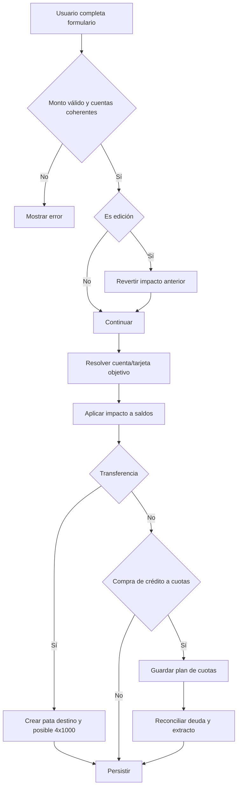
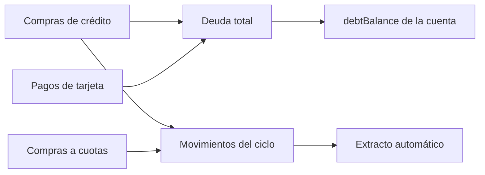
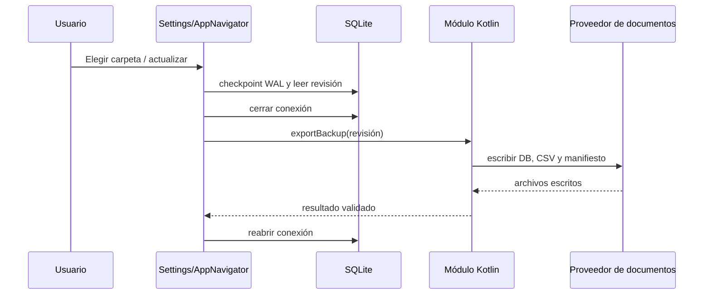

# Módulos y flujos

## 1. Mapa de módulos

| Módulo | Estado | Responsabilidad actual |
|---|---|---|
| `dashboard` | Activo | Totales financieros y accesos principales |
| `transactions` | Activo | Libro de movimientos, alta, edición, filtros y categorización |
| `accounts` | Activo | Cuentas/tarjetas débito y métricas asociadas |
| `categories` | Activo | Categorías de ingreso y gasto |
| `creditCards` | Activo | Tarjetas, extractos, cuotas, deuda y pagos |
| `security` | Activo en Android | PIN, biometría y puerta de acceso |
| `settings` | Activo | Preferencias, respaldo y borrado financiero |
| `budgets` | Marcador | Sin implementación funcional |
| `loans` | Marcador | Sin implementación funcional |
| `goals` | Marcador | Sin implementación funcional |
| `subscriptions` | Marcador | Sin implementación funcional |
| `reports` | Marcador | Sin implementación funcional |

## 2. Dashboard

Archivos centrales:

- `src/modules/dashboard/useCases/getDashboardSummary.ts`
- `src/modules/dashboard/hooks/useDashboardSummary.ts`
- `src/modules/dashboard/ui/DashboardScreen.tsx`

Fórmulas:

| Métrica | Regla |
|---|---|
| Saldo disponible | Suma de saldos de efectivo, cuenta bancaria y ahorro activos |
| Deuda total | Suma de `debtBalance` de tarjetas y préstamos activos |
| Patrimonio neto | Efectivo + bancos + ahorros + inversiones - deuda total |
| Ingreso mensual | Movimientos `income`, `inflow`, `posted` del mes actual |
| Gasto mensual | Movimientos `expense`, `outflow`, `posted` del mes actual |
| Ahorro mensual | Ingreso mensual - gasto mensual |
| Movimientos recientes | Publicados entre hoy y los 30 días anteriores |

Los pagos de tarjeta y las transferencias internas quedan fuera de ingreso/gasto por su tipo, aunque sí existen en el libro.

## 3. Movimientos

Archivos centrales:

- `src/modules/transactions/useCases/saveManualTransaction.ts`
- `src/modules/transactions/repositories/sqliteTransactionRepository.ts`
- `src/modules/transactions/hooks/useTransactionsList.ts`
- `src/modules/transactions/ui/TransactionsScreen.tsx`

Tipos admitidos: ingreso, gasto, transferencia interna, pago de tarjeta, pago de préstamo, inversión, reembolso y ajuste manual.

### Alta o edición manual

Las ediciones preservan `id`, `createdAt`, fecha y moneda del movimiento original. Antes de aplicar los nuevos valores se revierte su impacto previo, incluido el movimiento de impuesto relacionado si existe.

### Transferencias

Una transferencia guarda:

1. Movimiento de origen `internalTransfer` con salida y `targetAccountId`.
2. Movimiento acompañante de entrada en la cuenta destino.
3. Opcionalmente, un gasto separado con identificador `<transacción>-4x1000`.

El filtro por cuenta evita mostrar ambas patas como si fueran el mismo lado. La transferencia no aumenta los gastos mensuales, mientras el impuesto sí es un gasto real.

### Crédito sin tarjeta creada

Cuando una compra de crédito no coincide con una tarjeta activa, se asigna a la cuenta especial `account-credit-card-unclassified`. Al crear una tarjeta cuyos datos coinciden con la pista, los movimientos pendientes se reasignan y se vuelve a calcular la deuda.

## 4. Cuentas débito

Archivos centrales:

- `src/modules/accounts/useCases/manageDebitCards.ts`
- `src/modules/accounts/useCases/getDebitCardsOverview.ts`
- `src/modules/accounts/repositories/sqliteAccountRepository.ts`
- `src/modules/accounts/ui/DebitCardsScreen.tsx`

El módulo considera como débito los tipos `bankAccount` y `savingsAccount`. Los metadatos de ingresos recurrentes se serializan dentro de `accounts.description` con un prefijo privado del módulo.

Operaciones:

- crear o actualizar una cuenta;
- validar nombre, banco y saldo;
- guardar tipo/frecuencia/monto/día de ingreso esperado;
- cerrar lógicamente una cuenta;
- calcular ingresos, recargas, pagos, transferencias y neto mensual;
- construir una tendencia diaria de siete días;
- preparar un borrador de transferencia hacia movimientos.

## 5. Tarjetas de crédito

Archivos centrales:

- `src/modules/creditCards/useCases/manageCreditCards.ts`
- `src/modules/creditCards/useCases/getCreditCardsOverview.ts`
- `src/modules/creditCards/useCases/creditCardTransactionRelations.ts`
- `src/modules/creditCards/repositories/sqliteCreditCardRepository.ts`
- `src/modules/creditCards/ui/CreditCardsScreen.tsx`

### Gestión

Una tarjeta es una `Account` con tipo `creditCard`. El perfil separado guarda la tasa mensual. Los últimos cuatro dígitos, días de corte/pago y cuota de manejo se guardan como JSON con prefijo dentro de `accounts.description`.

La tasa efectiva anual ingresada por el usuario se transforma a tasa mensual para los cálculos. La eliminación visible es un cierre lógico y se bloquea si existen cuotas activas, saldo usado o movimientos vigentes sin liquidar.

### Reconciliación

- La deuda usa el importe completo de las compras menos los pagos.
- En un extracto, una compra activa a varias cuotas aporta su valor mensual.
- El pago genera una transferencia desde una cuenta débito/ahorro y no un gasto.
- El importe pagado se limita a la deuda pendiente y requiere saldo de origen suficiente.

### Simulación de pago mínimo

El resumen estima amortización con la tasa mensual configurada y el pago mínimo. Si el pago no cubre el interés del periodo, el resultado se marca como no amortizable en lugar de prometer una fecha falsa.

## 6. Categorías

Archivos centrales:

- `src/modules/categories/useCases/manageCategories.ts`
- `src/modules/categories/repositories/sqliteCategoryRepository.ts`
- `src/modules/categories/ui/CategoriesScreen.tsx`

La interfaz administra categorías de tipo ingreso y gasto. Los nombres se normalizan, no se permiten duplicados dentro del mismo tipo y el color es obligatorio.

`category-other` es la categoría de respaldo protegida. Al eliminar otra categoría, el repositorio reasigna movimientos y reglas relacionadas a `Otros`, limpia referencias de subcategoría incompatibles y después elimina la fila.

## 7. Ajustes

Archivos centrales:

- `src/modules/settings/useCases/manageSettings.ts`
- `src/modules/settings/repositories/sqliteSettingsRepository.ts`
- `src/modules/settings/repositories/sqliteFinancialDataRepository.ts`
- `src/modules/settings/ui/SettingsScreen.tsx`

Preferencias persistidas:

- `theme`: `dark` o `light`;
- `biometricsEnabled`;
- `localCredentialEnabled`.

El borrado financiero elimina las tablas de dominio en orden seguro, conserva `app_settings`, y luego el navegador vuelve a sembrar cuentas básicas con saldo cero y categorías. No vuelve a insertar la demo de tarjetas.

## 8. Seguridad

`AppAccessGate` cubre cualquier ruta cuando el estado global está bloqueado. Si se proporciona un PIN, se valida directamente. Sin PIN introducido, se intenta biometría; si falla y hay credencial local, se ofrece el formulario de PIN.

El bloqueo se reactiva cuando la aplicación vuelve al estado `active`, siempre que al menos un método esté habilitado.

## 9. Respaldo

Flujo Android:

El estado remoto se obtiene leyendo `smartfin-manifest.json`. Si la revisión local crece, la aplicación presenta un aviso. El significado y las limitaciones de privacidad están en [Seguridad y privacidad](SEGURIDAD_Y_PRIVACIDAD.md).

## 10. Módulos preparados

El esquema ya reserva entidades para presupuestos, sobres, suscripciones, préstamos, amortizaciones, metas, inversiones, recibos, impuestos, flujo de caja y score financiero. Estas tablas son infraestructura futura, no una API funcional. Cada módulo debe añadir tipos, repositorio, casos de uso, pruebas y UI antes de declararse implementado.
